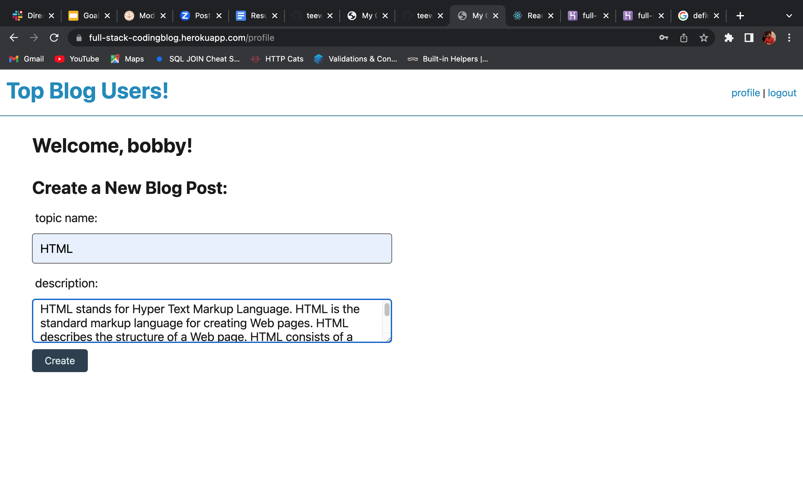

# full-stack-coding-blog

## Description

I was motivatied to complete this project because I wanted to make a blog to help teach a user about full stack coding.  This website will have different post on my blog that will have links and descriptions on Full-Stack developing. Making your own personal blog will also be and option for the user. Building this webpage helped me get a better understanding on the log-in/out, sign-up and how to use handlebars in HTML.

## Table of Contents (Optional)

- [Installation](#installation)
- [Usage](#usage)
- [Credits](#credits)
- [License](#license)
- [Website](#website)

## Installation

You will need to install package.json, node modules, session, sequlize, and express to run this project.

## Usage

Login or sign up for blog. Then create a topic and a descripiton. It will then post to your blog. There is a Top Blog Users in the top left hand corner. You can click it to view the top bloggers.

## Credits

N/A

## License

MIT License

## How to Contribute

No contributes needed for this project.

## Website

Picture of website below:

Website link below:

https://full-stack-codingblog.herokuapp.com/login

